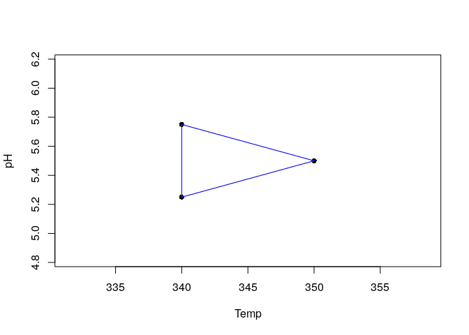

<!-- README.md is generated from README.Rmd. Please edit that file -->

# labsimplex

This package implements the simplex algorithms (fixed and variable
step-size) for laboratory and proccess optimizations.

## Installation

The development versión of labsimplex can be installed using
`install_github()` function from `devtools` package:

``` r
devtools::install_github(repo = 'crparedes/labsimplex', build_vignettes = TRUE)
```

The released version of labsimplex is available from
[CRAN](https://CRAN.R-project.org) with:

``` r
install.packages("labsimplex")
```

## Example

This is a basic example which shows you how to start an optimization
procces:

Suppose there is a reaction taking place in water at determinate pH and
temperature. Both variables have shown to have effect on the yiel of the
reaction and the purposse is to maximize it. Ussually the reaction is
made at 350 °C and pH 5.5. This will be the starting point. Rational
changes can be made in steps of 10°C and 0.5 units of pH for each
variable.

``` r
library(labsimplex)
yield <- labsimplex(n = 2, start = c(350, 5.5), var.name = c('Temp', 'pH'),
                    stepsize = c(10, 0.5))
print(yield)
#> Current simplex:
#>           Temp   pH . Response Label Nature
#> Vertex.1:  350 5.50 |       NA    NA      S
#> Vertex.2:  340 5.75 |       NA    NA      S
#> Vertex.3:  340 5.25 |       NA    NA      S
#> 
#> Conventions:
#>     Labels:                    Nature:
#>        W: Worst or Wastebasket    S:  Starting
#>        N: Next to the worst       R:  Reflected
#>        B: Best                    E:  Expanded
#>                                   Cr: Contraction on the reflection side
#>        D: Disregarded             Cw: Contraction on the worst side
#> 
#>       Use print(..., conventions = FALSE) to disable conventions printing.
```

Is possible to plot the simplex object to visualize the coordinates of
the vertexes:

``` r
plot(yield)
```



The experiments corresponding to the Temp. and pH values indicated for
each vertex must be performed and the response must be recorded. Suppose
the responses for vertexes 1 to 3 were 57%, 65% and 54% respectively.
The new vertex can be generated and the simplex movement can be
visualized again ploting the simplex.

``` r
generateVertex(simplex = yield, qflv = c(57, 65, 54), overwrite = TRUE)
#> New vertex to be evaluated: 
#> Temp   pH 
#>  350    6
plot(yield)
```


For more information, read the package manual and vignette.
